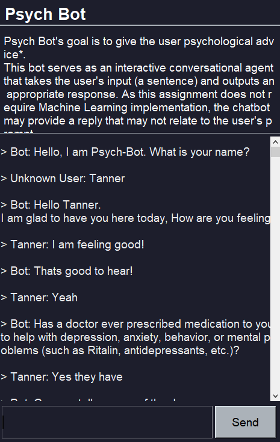
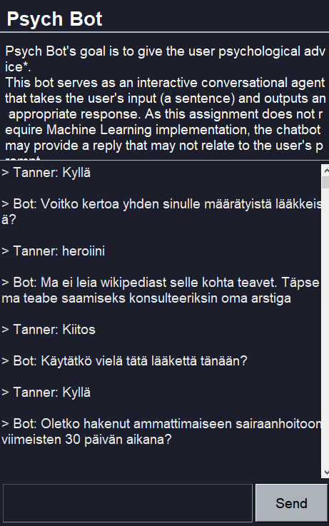
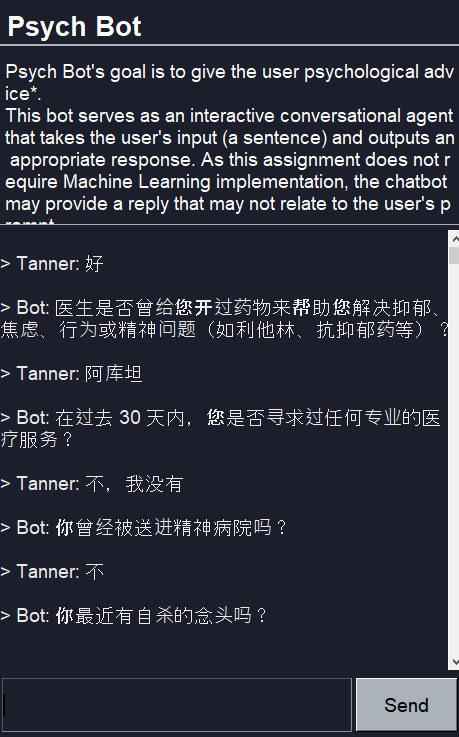
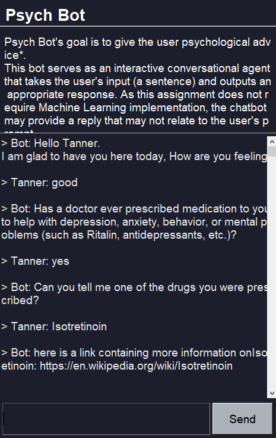
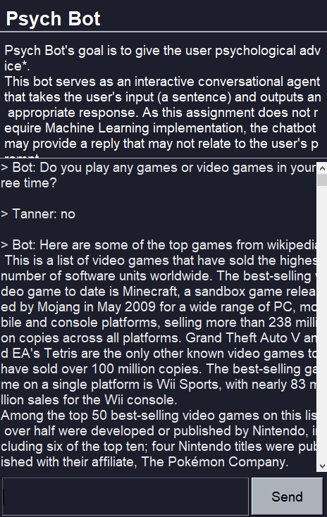
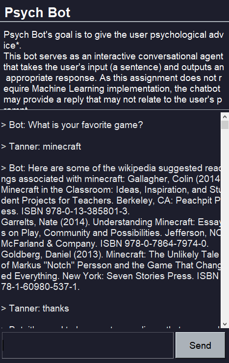
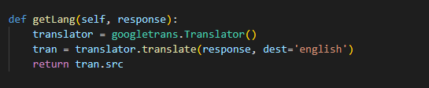
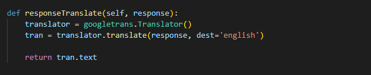
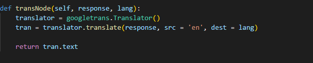

# Psych Bot

### Navigation
- [Project Setup](#project-setup)
- [Project Description](#project-description)
- [Project Documentation](#project-documentation)
- [Unit Tests](#unit-tests)
- [Assignment 4 Documentation](#assignment-4-documentation)
- [Assignment 4 New Features](#assignment-4-new-features)
- [New Methods](#new-methods)
- [Contributors](#contributors)
- [Presentation](#a4-presentation)

## Project Setup

***Pre-requisites*** - Install the latest version of Python on your computer (Python3 is strongly recommended),
and the package management system (PIP).
After cloning the repository to your computer, follow these steps to launch the program:

**Step 1:** Open the repository in your IDE ([Visual Studio Code](https://visualstudio.microsoft.com/vs/) is recommended).  
&nbsp;  
### **For Windows**  
&nbsp;

**Step 2:** Open your Powershell command line tool.

**Step 3:** Create a virtual environment by running the following command:

```bash
python -m venv venv 
```
**Step 4:** Run a virtual environment by running the following command:
```bash
 ./venv/Scripts/activate.ps1
```
**Step 5:** Run the following to command to install all necessary dependecies:
```bash
pip install -r requirements.txt
```  
**Step 6:** Start the program by running this command:
```bash
python app.py
```
&nbsp; 

### **For Unix Based Systems**  
&nbsp;  
**Step 2:** Open a terminal in your VSCode by going to ***Terminal > New Terminal***  
**Step 3:** Run the following to command to install all necessary dependecies:
```bash
pip install -r requirements.txt
```  
**Step 4:** Start the program by running this command:
```bash
python3 app.py
```
&nbsp; 

## Project Description
The project was created for the UBC Okanagan third year level course.

**Psych Bot's** goal is to give the user psychological advice*. This bot serves as an interactive conversational agent that takes the user's input (a sentence) and outputs an appropriate response. As this assignment does not require Machine Learning implementation, the chatbot may provide a reply that may not relate to the user's prompt.


*For **legal** reasons, neither the bot nor developers are certified to provide medical help.


## Previous Project Documentation
- [Project Plan Document](https://github.com/KentonMewling/Psych-Bot/blob/main/docs/Assignment2_Project_Plan.pdf)
- [Word Breakdown Structure](https://github.com/KentonMewling/Psych-Bot/blob/main/docs/WBS.png)
- [Gantt Chart](https://github.com/KentonMewling/Psych-Bot/blob/main/docs/Gantt%20Chart.png)
- [Network Graph/Branch & Commits](https://github.com/KentonMewling/Psych-Bot/network)
- [Unit Test Documentation](https://github.com/KentonMewling/Psych-Bot/blob/main/docs/UnitTesting_documentation.pdf)
- [API Documentation](docs/API.pdf)


## Unit Tests

### **For Windows**
&nbsp;

**Step 1:** Open your Powershell command line tool.

**Step 2:** To run the unit test in the Bot class run this command:
```bash
python tests/bot.test.py 
```
**Step 3:** To run the unit test in the FileReader class run this command:
```bash
python tests/fileReader.test.py
```
&nbsp;
### **For Unix Based Systems**
&nbsp;

**Step 1:** Open a terminal in your VSCode by going to ***Terminal > New Terminal*** 

**Step 2:** To run the unit test in the Bot class run this command:
```bash
python3 tests/bot.test.py
```
**Step 3:** To run the unit test in the FileReader class run this command:
```bash
python3 tests/fileReader.test.py
```
&nbsp;

## Assignment 4 Documentation 
- [Assignment 4 Project Documentation](https://github.com/KentonMewling/PsychBot-A4/blob/main/docs/PsychBot%20-%20API%20Documentation.pdf)

## Assignment 4 New Features

### Google Translate API ###

**>The bot is able to understand the users language and respond in the langauge of the user, using googletrans API.**

<table>
  <tr>
     <td>Language : English</td>
     <td>Language : Finnish</td>
     <td>Language : Chinese</td>
  </tr>
  <tr>
    <td></td>
    <td></td>
   <td></td>
  </tr>
 </table>
 
 ### Wikipedia API ###

 **>User can interact with the bot and get information directly from wikipedia based off of the users input.**
 
 <table>
  <tr>
    <td>English Link to a Wikipedia page</td>
  </tr>
  <tr>
    <td></td>
   <td></td>
   <td></td>
  </tr>
 </table>
 
## New Methods
 **API Documentation file has more information regarding the uses and functionality of each of the API's.**
 
**A4: getLang function**
This function will get the language the user is using based on google translates certainty determining function and will return the language back to the bot.




**A4: responseTranslate function**
This function will take in the users response and translate it to english so the response can be understood by the correct node.




**A4: transNode function**
This function takes in the responce the bot will answer with and the users language that was determined from the getLang function and will translate the bot's response to the users language.



## A4 Presentation 
https://drive.google.com/file/d/1-9s3aBWBw8l101RgClK3metLziD5P6yQ/view

## Contributors
- [@KentonMewling](https://github.com/KentonMewling)

